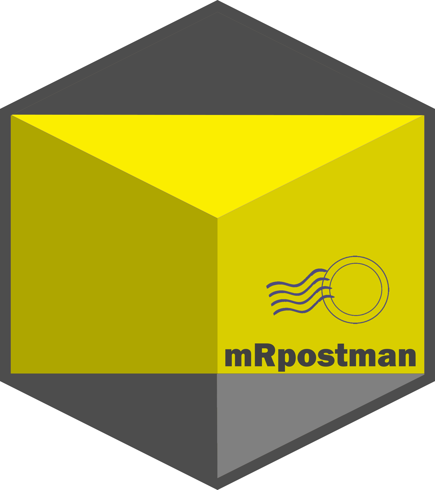

## mRpostman - IMAP Tools for R in a Tidy Way

__mRpostman__ is an __R__ package to help you to easy connect to your IMAP (Internet Message Access Protocol) server and execute commands, such as listing mailboxes, fetching and searching for messages in a tidy way. It heavily relies on {curl} for issuing the IMAP commands. 

So far, `mRpostman` have been tested with Gmail, Yahoo Mail and AOL Mail, but it should also work with other mail providers. I would be happy to hear other successful experiences from users.

ATTENTION: Before you start, you have to enable **"less secure apps access"** in your mail account settings.

There is a detailed vignette [HERE](https://allanvc.github.io/mRpostman/articles/basics.html) showing how to use the package!

That's all!

* Official website: https://allanvc.github.io/mRpostman
* CRAN version: https://cran.r-project.org/package=mRpostman
* Dev version: https://github.com/allanvc/mRpostman

